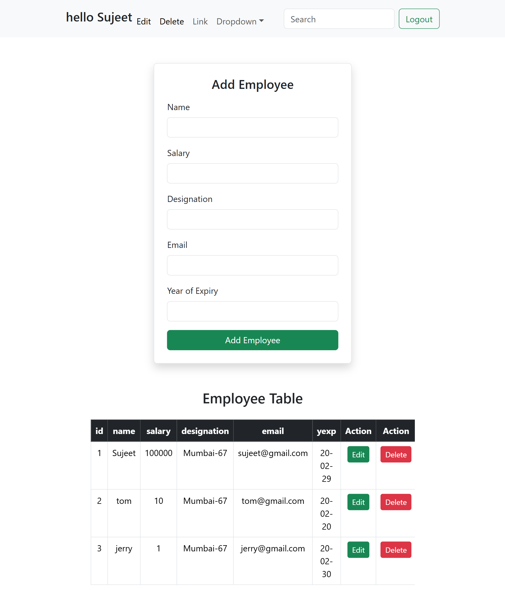
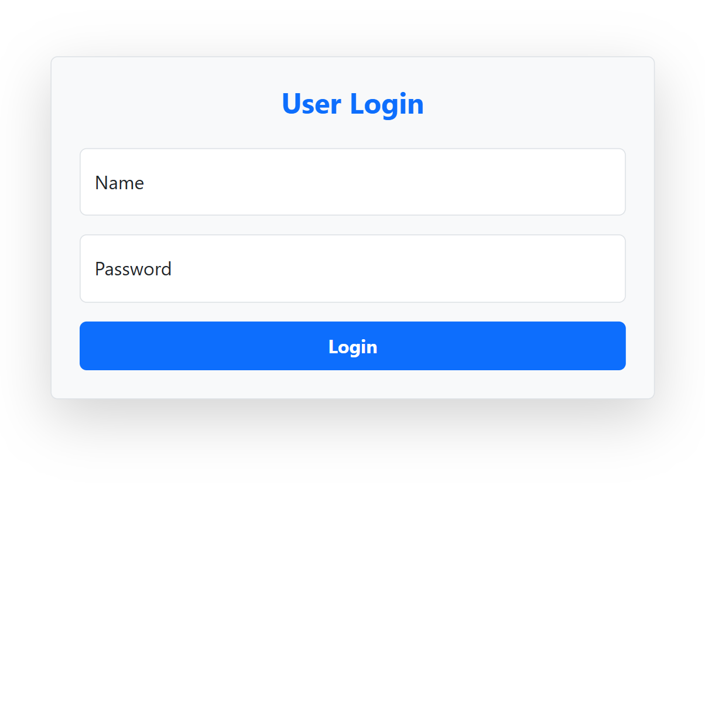
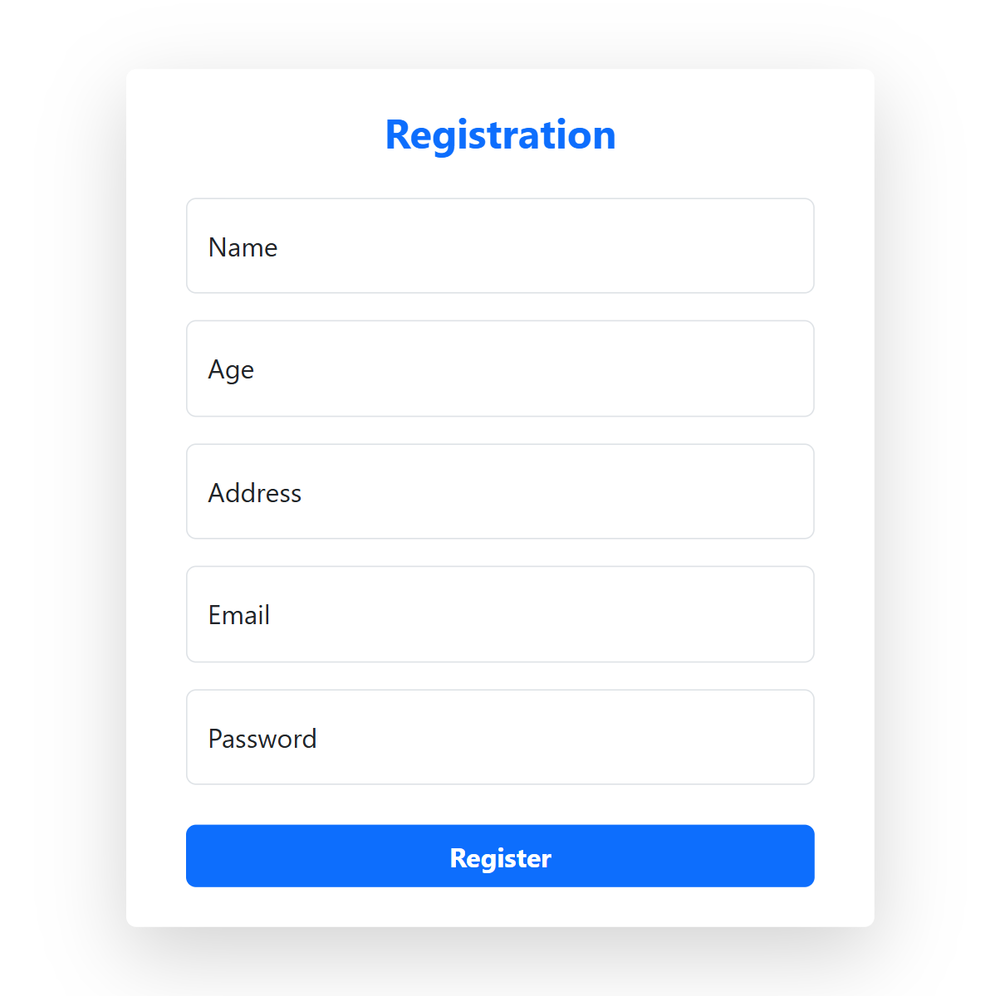
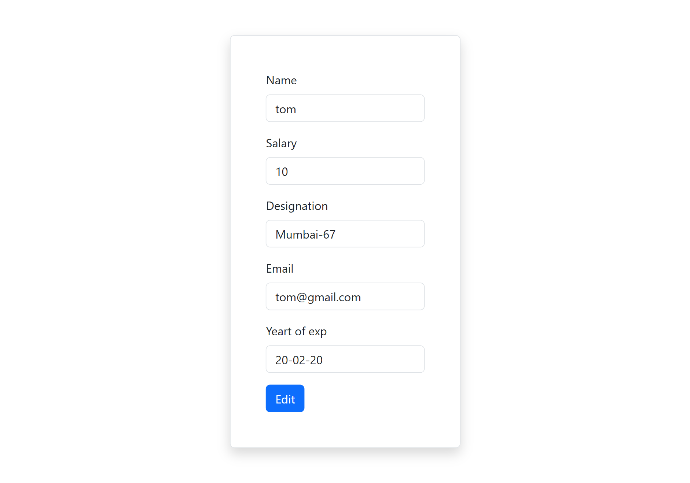

# User Management System

## Overview
Basic PHP CRUD (Create, Read, Update, Delete) application for user management with authentication. Built for XAMPP/local PHP/MySQL environment.

**Tech Stack:**
- PHP
- MySQL
- HTML/CSS/JS (basic)
- XAMPP

## Features
- User Registration
- User Login/Logout
- View all users (Home)
- Edit user details
- Delete users
- Responsive UI (screenshots provided)

## Prerequisites
- [ ] XAMPP (Apache + MySQL)
- [ ] PHP 7+
- [ ] MySQL

## Setup Instructions
1. **Start XAMPP:**
   - Apache and MySQL services.

2. **Database:**
   - phpMyAdmin: `http://localhost/phpmyadmin`
   - Create database `j1_php` (per db.php).
   - Users table (run if missing):
     ```sql
     CREATE TABLE users (
         id INT AUTO_INCREMENT PRIMARY KEY,
         name VARCHAR(100),
         email VARCHAR(100) UNIQUE,
         password VARCHAR(255)
     );
     ```

3. **Deploy:**
   - Folder already in `htdocs/User Management`.
   - Edit `db.php` if DB details change:
     ```php
     <?php
     $conn = new mysqli("localhost", "root", "", "j1_php");
     if ($conn->connect_error) {
         die("Connection failed: " . $conn->connect_error);
     }
     ?>
     ```

4. **Run:**
   - `http://localhost/User Management/Login.php`
   - Register → Login → Manage users.

## Project Structure
```
.
├── db.php              # DB connection
├── Home.php            # List users
├── Login.php           # Login form
├── Registration.php    # Register form
├── Edit.php            # Edit user
├── Delete.php          # Delete handler
├── Logout.php          # Logout
├── README.md           # This file
├── TODO.md             # Task tracker
└── image/              # UI screenshots
    ├── editpage.png
    ├── homePage.png
    ├── loginPage.png
    └── registrationPage.png
```

## Usage
1. Register new user.
2. Login.
3. Home: View/Edit/Delete users.
4. Logout.

## Screenshots





## GitHub
https://github.com/sujeetrajbhar681/User-Management.git

## Troubleshooting
- DB connection: Check `db.php` credentials, MySQL running.
- Blank pages: Enable PHP error reporting (`error_reporting(E_ALL);` in php.ini).
- Passwords hashed in Registration.php.


